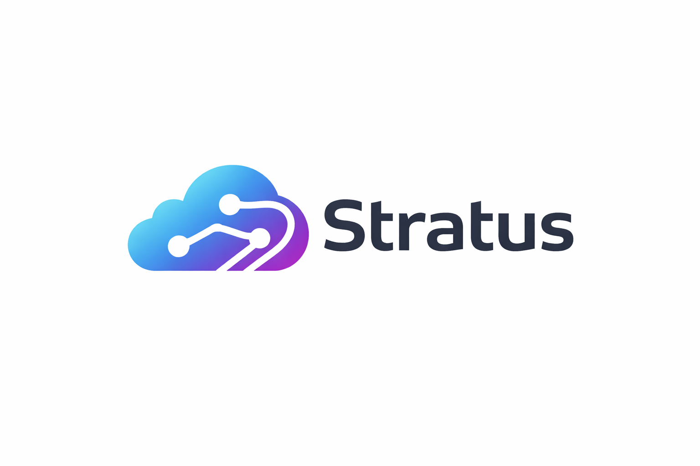

<p align="center">
  
</p>

<h1 align="center">stratus v2</h1>

<p align="center">A lightweight Claude Code extension framework — persistent memory, intelligent retrieval, spec-driven orchestration, and an embedded terminal dashboard.</p>

Single binary (~15 MB), zero runtime dependencies.

## vs stratus v1 (Python)

| | Python | Go v2 |
|---|---|---|
| Backend | 29 k LOC, 164 files | ~4.5 k LOC, ~25 files |
| Frontend | 3.9 k LOC vanilla JS | ~2 k LOC Svelte 5 |
| Databases | 4 SQLite, 18+ tables | 1 SQLite, 8 tables |
| Deployment | Python + pip + venv | Single binary |
| State | JSON files on disk | DB-backed state machine |

## Features

- **Memory** — FTS5 event store with deduplication, TTL, timeline, and scoped search
- **Retrieval** — Dual-backend: Vexor (code embeddings) + FTS5 governance docs, auto-routed
- **Orchestration** — Pure state machine for spec and bug workflows with task tracking
- **Learning** — Pattern candidate detection → proposals → accept/reject decisions
- **Terminal** — Embedded PTY terminal in the dashboard via xterm.js + WebSocket
- **STT** — Web Speech API in dashboard + Whisper proxy endpoint
- **MCP** — 7 tools: `search`, `timeline`, `get_observations`, `save_memory`, `retrieve`, `index_status`, `delivery_dispatch`
- **Hooks** — `phase_guard`, `delegation_guard`, `workflow_enforcer`

## Install

```bash
go install github.com/MartinNevlaha/stratus-v2/cmd/stratus@latest
```

Or build from source:

```bash
git clone https://github.com/MartinNevlaha/stratus-v2
cd stratus-v2
go build -o stratus ./cmd/stratus
```

Cross-compile:

```bash
GOOS=linux  GOARCH=amd64 go build -o stratus-linux-amd64  ./cmd/stratus
GOOS=darwin GOARCH=arm64 go build -o stratus-darwin-arm64 ./cmd/stratus
```

## Quick Start

```bash
# 1. Initialize project (writes .stratus.json, .mcp.json, .claude/skills/)
cd your-project
stratus init

# 2. Start server (dashboard + API on :41777)
stratus serve

# 3. Open dashboard
open http://localhost:41777
```

Add hooks to `.claude/settings.json`:

```json
{
  "hooks": {
    "PreToolUse": [
      {"command": "stratus hook phase_guard"},
      {"command": "stratus hook delegation_guard"}
    ]
  }
}
```

## Skills

`stratus init` writes coordinator skills to `.claude/skills/`:

| Skill | Description |
|-------|-------------|
| `/spec` | Spec-driven development: plan → implement → verify → learn |
| `/bug` | Bug-fixing workflow: analyze → fix → review → complete |
| `/learn` | Pattern learning: detect candidates, generate proposals |
| `/sync-stratus` | Installation health check: audits agents, skills, rules, hooks |

## API

### Memory

```
POST   /api/events              Save memory event (with deduplication)
GET    /api/events/search       FTS5 full-text search
GET    /api/events/{id}/timeline Chronological context around an event
POST   /api/events/batch        Batch fetch events by IDs
```

### Orchestration

```
POST   /api/workflows                         Start workflow (spec|bug)
GET    /api/workflows/{id}                    Get state
PUT    /api/workflows/{id}/phase              Transition phase
POST   /api/workflows/{id}/delegate           Record agent delegation
POST   /api/workflows/{id}/tasks              Set task list
POST   /api/workflows/{id}/tasks/{n}/start    Mark task in-progress
POST   /api/workflows/{id}/tasks/{n}/complete Mark task done
DELETE /api/workflows/{id}                    Abort workflow
GET    /api/workflows/{id}/dispatch           Dispatch info for MCP
```

### Retrieval

```
GET    /api/retrieve            Semantic search (code + governance, auto-routed)
GET    /api/retrieve/status     Index freshness and Vexor availability
POST   /api/retrieve/index      Trigger re-index of governance docs
```

### Learning

```
GET    /api/learning/candidates             List pattern candidates
POST   /api/learning/candidates             Save a candidate
GET    /api/learning/proposals              List proposals
POST   /api/learning/proposals/{id}/decide  Accept / reject / snooze / ignore
```

### Other

```
GET    /api/dashboard/state     Aggregated state for the dashboard
POST   /api/stt/transcribe      Whisper proxy (multipart audio)
GET    /api/stt/status          STT endpoint availability
GET    /api/health              Health check
WS     /api/ws                  Real-time dashboard updates
WS     /api/terminal/ws         PTY terminal I/O
```

## Configuration

`.stratus.json` in project root (created by `stratus init`):

```json
{
  "port": 41777,
  "data_dir": "~/.stratus/data",
  "project_root": ".",
  "vexor": {
    "binary_path": "vexor",
    "model": "nomic-embed-text-v1.5",
    "timeout_sec": 15
  },
  "stt": {
    "endpoint": "http://localhost:8765"
  }
}
```

Environment overrides: `STRATUS_PORT`, `STRATUS_DATA_DIR`.

## Architecture

```
cmd/stratus/        CLI entry point, go:embed for skills
config/             Config loading (.stratus.json + env)
db/                 SQLite: memory events, governance docs, learning, workflows
orchestration/      Pure state machine (spec + bug workflows)
api/                HTTP server, REST routes, WebSocket hub
mcp/                MCP stdio server (JSON-RPC, 7 tools)
hooks/              Claude Code hook handlers
terminal/           PTY session management + WebSocket I/O
vexor/              Vexor CLI wrapper for code embeddings
frontend/           Svelte 5 dashboard
```

### Database schema (1 SQLite, 8 tables)

| Table | Purpose |
|-------|---------|
| `events` | Memory event store |
| `events_fts` | FTS5 index on events |
| `sessions` | Claude Code session tracking |
| `docs` | Governance document chunks |
| `docs_fts` | FTS5 index on docs |
| `candidates` | Learning pattern candidates |
| `proposals` | Learning proposals |
| `workflows` | Orchestration state |

## Frontend Development

```bash
cd frontend
npm install
npm run dev      # dev server on :5173
npm run build    # builds to ../static/
```

## MCP Tools

Register in `.mcp.json` (created by `stratus init`):

```json
{
  "mcpServers": {
    "stratus": {
      "type": "stdio",
      "command": "stratus",
      "args": ["mcp-serve"]
    }
  }
}
```

Available tools: `search`, `timeline`, `get_observations`, `save_memory`, `retrieve`, `index_status`, `delivery_dispatch`.
