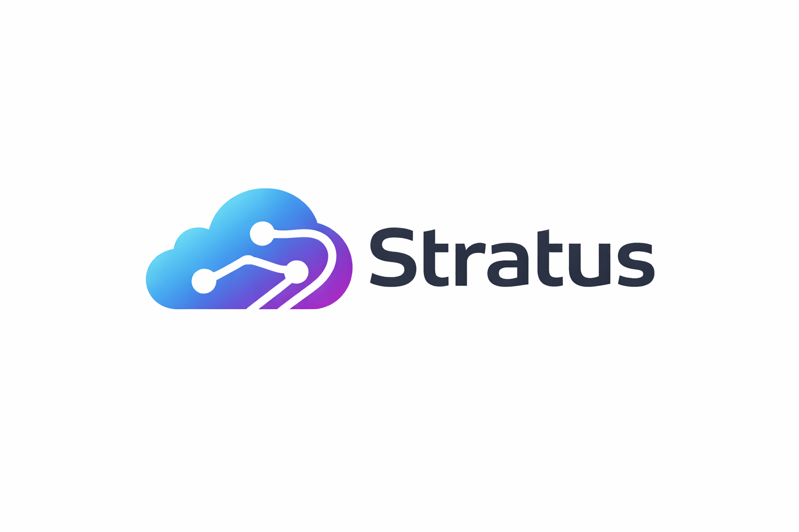

<p align="center">
  
</p>

<h1 align="center">stratus v2</h1>

<p align="center">
  <strong>A production-grade AI development framework for Claude Code and OpenCode.</strong><br/>
  Persistent memory · semantic retrieval · spec-driven orchestration · multi-agent swarms · Playwright E2E testing · voice input · live dashboard.
</p>

<p align="center">
  Single binary (~15 MB) · zero runtime dependencies · SQLite-backed · WebSocket real-time
</p>

---

## What it is

Stratus gives your AI coding assistant a persistent brain, a structured workflow engine, and the ability to coordinate multiple agents working in parallel — all visible from a live dashboard. It runs as a local server alongside Claude Code or OpenCode and exposes 15 MCP tools that agents use to remember, retrieve, and coordinate.

### Why it matters

Out of the box, Claude Code and OpenCode have no memory across sessions, no structure for complex multi-phase features, and no way to run multiple agents coordinating on the same codebase. Stratus fills all three gaps:

| Without Stratus | With Stratus |
|-----------------|--------------|
| Context window fills up, knowledge is lost | Persistent event store with FTS5 full-text search + semantic retrieval |
| Each session starts from scratch | Agents build on previous decisions, bugs fixed, patterns learned |
| One agent, one file at a time | Swarm: multiple agents in isolated worktrees, dispatched by domain |
| No visibility into what agents are doing | Live dashboard: workflow state, ticket progress, worker heartbeats |
| Governance docs ignored | Chunked, FTS-indexed, surfaced in context on every request |
| Patterns die with the conversation | Learning pipeline: detect → propose → accept → embed as rules |
| Type every prompt by hand | Voice input: describe features, dictate bug reports, think out loud — hands stay on code |

---

## Features

### Memory
- **FTS5 event store** with deduplication, TTL, importance scoring, scoped search (`repo`, `global`, `user`)
- **Timeline** — retrieve chronological context around any memory event
- **Session tracking** — every Claude Code session recorded with initial prompt
- **Tags + refs** — structured metadata on every event

### Retrieval
- **Dual-backend**: Vexor (code embeddings, semantic) + FTS5 (governance docs, keyword)
- **Auto-routed** — code-like queries go to Vexor; governance/ADR queries go to FTS5
- **Watcher hook** — re-indexes on every file write, always fresh
- **Governance docs** — your ADRs, rules, and `.claude/` files chunked and indexed automatically

### Orchestration
- **Pure state machine** — explicit phase transitions enforced before any DB write
- **Spec workflow** (simple): `plan → implement → verify → learn → complete`
- **Spec workflow** (complex): `plan → discovery → design → governance → accept → implement → verify → learn → complete`
- **Bug workflow**: `analyze → fix → review → complete` (review loops back to fix)
- **E2E workflow**: `setup → plan → generate → heal → complete` (heal loops back to generate)
- **Task tracking** — per-workflow task list with progress visible in dashboard
- **Guard hooks** — `phase_guard` blocks invalid transitions, `workflow_existence_guard` requires a registered workflow before delegation, `delegation_guard` enforces agent rules

### Multi-Agent Swarm

**Claude Code** — parallel workers in isolated git worktrees:
- Each worker gets its own `swarm/<mission>/<worker>` branch
- Domain-based dispatch: backend → frontend → database → tests → infra
- Workers run via Claude Code `Task` tool, truly parallel
- Merge queue (Forge) collects completed branches for integration
- Heartbeat monitoring — stale workers automatically detected and flagged

**OpenCode** — sequential workers on the same branch:
- Same mission/ticket/worker tracking, full dashboard visibility
- Workers execute as `@agent-name` delegations, one at a time
- File reservations prevent edit conflicts between sequential workers
- Checkpoints after each worker — resume interrupted missions from last checkpoint
- Decomposition strategy tracking: `file-based` / `feature-based` / `risk-based` / `domain-based`

### Delivery Agents (13)
Pre-configured, automatically written to `.claude/agents/` or `.opencode/agents/`:

| Agent | Speciality |
|-------|-----------|
| `delivery-backend-engineer` | API, handlers, business logic |
| `delivery-frontend-engineer` | Svelte, React, UI components |
| `delivery-database-engineer` | Schema, migrations, queries |
| `delivery-qa-engineer` | Tests, coverage, edge cases |
| `delivery-devops-engineer` | CI/CD, Docker, infrastructure |
| `delivery-mobile-engineer` | React Native, mobile UX |
| `delivery-system-architect` | Architecture, ADRs, decomposition |
| `delivery-strategic-architect` | High-level strategy, tech direction |
| `delivery-code-reviewer` | Quality, correctness, best practices |
| `delivery-governance-checker` | Compliance with project rules |
| `delivery-ux-designer` | UX, accessibility, design systems |
| `delivery-debugger` | Root cause analysis, bug hunting |
| `delivery-implementation-expert` | Mixed/general implementation |

### Playwright Test Agents (E2E)

Autonomous end-to-end test creation and maintenance using [Playwright Test Agents](https://playwright.dev/docs/test-agents). Registered in `opencode.json` during `stratus init --target opencode`:

| Agent | Role |
|-------|------|
| `playwright-test-planner` | Explores the app via browser, creates structured test plans in `specs/` |
| `playwright-test-generator` | Converts plans into executable Playwright test files in `tests/` |
| `playwright-test-healer` | Runs tests, diagnoses failures, auto-fixes broken selectors/timing/assertions |

The `/e2e` command orchestrates the full flow:

1. **Setup** — installs Playwright, creates `playwright.config.ts`, seed test, and `specs/` directory
2. **Plan** — delegates to planner agent which navigates the app and writes test plans
3. **Generate** — delegates to generator agent for each scenario (creates one test file per scenario)
4. **Heal** — delegates to healer agent which runs all tests and fixes failures (loops back to generate if needed)
5. **Complete** — reports summary with pass/fail status

Each agent runs as an OpenCode subagent with fine-grained Playwright MCP tool permissions. The `playwright-test` MCP server (`npx playwright run-test-mcp-server`) provides browser control, verification, and test execution tools.

### Learning Pipeline
1. **Detect** — agents save pattern candidates via MCP (`detection_type`, `confidence`, `files`)
2. **Propose** — candidates generate proposals: rules, ADRs, or templates (`proposed_content`, `proposed_path`)
3. **Decide** — accept / reject / snooze / ignore via dashboard or API
4. **Embed** — accepted proposals written as `.claude/rules/` files, indexed into governance FTS

### Dashboard
- **Overview** — all workflows, missions, task progress, delegated agents, resume commands
- **Active Missions** — expandable swarm missions: workers grid, ticket list with progress bar, forge queue
- **Terminal** — full PTY terminal embedded 50/50 next to the overview via xterm.js + WebSocket
- **Voice input (STT)** — talk instead of type: describe a feature, dictate a bug report, or think out loud while your hands stay on code. One click to record, one click to transcribe. Runs locally via faster-whisper — no cloud, no API keys, no latency
- **Real-time** — all updates via WebSocket, no polling

### Analytics Dashboard

Real-time metrics visualization for workflow performance:

**Components:**
- **Summary Cards** — Total Workflows, Success Rate, Avg Duration, Tasks Completed
- **Workflow Trend Chart** — Line chart showing completed workflows over time
- **Agent Performance Chart** — Bar chart of tasks completed per agent
- **Success Rate Distribution** — Doughnut chart (High ≥80%, Medium 50-80%, Low <50%, Failed 0%)
- **Task by Domain** — Stacked bar chart showing success/failed tasks grouped by agent domain
- **Daily Metrics Table** — Historical metrics with newest first
- **Agent Performance Cards** — Per-agent stats (tasks, success rate, avg time)

**Architecture:**
```
┌─────────────────────────────────────────────────────┐
│                   FRONTEND                          │
│  Analytics.svelte                                   │
│  ├── onMount() → loadMetrics()                     │
│  ├── $effect() → WebSocket updates (debounced 2s)  │
│  └── generateChartData() → 4 Chart.js charts       │
└─────────────────────────────────────────────────────┘
                        │
                        │ HTTP GET /api/metrics/*
                        ▼
┌─────────────────────────────────────────────────────┐
│                   BACKEND                           │
│  api/routes_analytics.go                            │
│  ├── GET /api/metrics/summary?days=7              │
│  ├── GET /api/metrics/daily?limit=30              │
│  ├── GET /api/metrics/agents?days=30              │
│  └── GET /api/metrics/export?days=30 (CSV)        │
└─────────────────────────────────────────────────────┘
                        │
                        ▼
┌─────────────────────────────────────────────────────┐
│                   DATABASE                          │
│  db/metrics.go + db/aggregator.go                   │
│  Tables: daily_metrics, agent_metrics              │
│  AggregateYesterday() runs at server start         │
└─────────────────────────────────────────────────────┘
```

**Data Flow:**
1. Page load → 3 parallel API calls (summary, daily, agents)
2. WebSocket event → `analyticsUpdateCounter++` → debounced reload (2s)
3. LIVE badge shows for 30s after last WebSocket update
4. Charts auto-update with real data; "No Data" fallback when empty

**Time Range:** 7d / 30d / 90d selector with smart reload (skips if already selected)

### Hooks
| Hook | Behaviour |
|------|-----------|
| `phase_guard` | Blocks invalid workflow phase transitions before they reach the DB |
| `workflow_existence_guard` | Blocks Task delegation when the current session has no active workflow |
| `delegation_guard` | Applies delivery-agent delegation policy for the active session workflow |
| `workflow_enforcer` | Ensures agent follows active workflow phase |
| `watcher` | Re-indexes governance docs on every file write |

---

## Install

**Requirements:** Go 1.21+

```bash
go install github.com/MartinNevlaha/stratus-v2/cmd/stratus@latest
```

> If `@latest` resolves an old version (Go module proxy cache):
> ```bash
> GOPROXY=direct go install github.com/MartinNevlaha/stratus-v2/cmd/stratus@latest
> ```

Build from source:

```bash
git clone https://github.com/MartinNevlaha/stratus-v2
cd stratus-v2
make install     # builds frontend + Go binary → GOPATH/bin
```

| Make target | Description |
|-------------|-------------|
| `make install` | Build frontend + Go binary, install to `GOPATH/bin` |
| `make build` | Build frontend + Go binary, output `./stratus` |
| `make dev` | Start full dev loop: Go (air) + Vite with hot reload. Open `http://localhost:5173` |
| `make dev-backend` | Go backend only with air hot reload (no Vite) |
| `make dev-frontend` | Vite dev server only (no backend) |
| `make clean` | Remove `./stratus` build artifact |

---

## Quick Start

```bash
# 1. Initialize in your project
#    Writes .stratus.json, .mcp.json, .claude/{skills,agents,rules,settings.json}
cd your-project
stratus init                    # Claude Code (default)
stratus init --target opencode  # OpenCode
stratus init --target both      # Both simultaneously

# 2. Start the server (dashboard + API on :41777)
stratus serve

# 3. Open the dashboard
open http://localhost:41777

# 4. Start coding — in Claude Code:
/spec add JWT authentication
/swarm implement full auth system with refresh tokens

# Or in OpenCode:
/spec add JWT authentication
/swarm implement full auth system with refresh tokens
/e2e create tests for the login flow
```

Hooks are registered automatically — no manual `.claude/settings.json` edits needed.

---

## Skills

### Claude Code Skills (`/skill-name`)

| Skill | Description |
|-------|-------------|
| `/spec` | Spec-driven delivery: plan → implement → verify → learn |
| `/spec-complex` | Extended spec with discovery, design, governance, and accept phases |
| `/bug` | Bug-fixing workflow: analyze → fix → review → complete |
| `/swarm` | Multi-agent parallel execution in isolated git worktrees |
| `/e2e` | Playwright E2E testing: setup → plan → generate → heal |
| `/learn` | Pattern learning: detect candidates, generate proposals |
| `/resume` | Resume a workflow from where it left off |
| `/code-review` | Deep code review with structured feedback |
| `/run-tests` | Test execution with coverage reporting |
| `/find-bugs` | Systematic bug hunting and analysis |
| `/security-review` | OWASP and security vulnerability analysis |
| `/create-architecture` | Architecture design and documentation |
| `/explain-architecture` | Architecture explanation and diagramming |
| `/frontend-design` | UI/UX design and Svelte/React components |
| `/react-native-best-practices` | Mobile-specific patterns and conventions |
| `/vexor-cli` | Code embedding and semantic search via Vexor |
| `/governance-db` | Governance document management |
| `/sync-stratus` | Health check: audits agents, skills, rules, hooks |

### OpenCode Commands (`/command-name`)

| Command | Description |
|---------|-------------|
| `/spec` | Spec-driven delivery (sequential, same branch) |
| `/spec-complex` | Full-phase spec workflow |
| `/bug` | Bug-fixing workflow |
| `/swarm` | Multi-agent coordination with file reservations + checkpointing |
| `/e2e` | Playwright E2E testing: setup → plan → generate → heal |
| `/learn` | Pattern learning pipeline |
| `/team` | Team coordination and handoff |
| `/sync-stratus` | Installation health check |

---

## MCP Tools (15)

Registered in `.mcp.json` (Claude Code) or `opencode.json` (OpenCode) by `stratus init`:

| Tool | Description |
|------|-------------|
| `search` | FTS5 full-text search across memory events |
| `timeline` | Chronological context around a memory event |
| `get_observations` | Batch fetch full event details by IDs |
| `save_memory` | Persist a memory event (with deduplication) |
| `retrieve` | Semantic/keyword search across code + governance docs |
| `index_status` | Index freshness and Vexor/FTS backend availability |
| `delivery_dispatch` | Delivery phase briefing and delegation instructions |
| `swarm_heartbeat` | Worker liveness signal (keeps worker marked active) |
| `swarm_signals` | Poll unread signals for a worker |
| `swarm_ticket_update` | Update ticket status (`in_progress` / `done` / `failed`) |
| `swarm_submit_merge` | Submit worker branch to the Forge merge queue |
| `swarm_send_signal` | Send a typed signal to another worker or broadcast |
| `swarm_reserve_files` | Atomically reserve file patterns (conflict detection) |
| `swarm_release_files` | Release all file reservations for a worker |
| `swarm_checkpoint` | Save coordinator state snapshot for crash recovery |

---

## API Reference

### Memory
```
POST   /api/events                       Save memory event (with deduplication)
GET    /api/events/search                FTS5 full-text search
GET    /api/events/{id}/timeline         Chronological context around an event
POST   /api/events/batch                 Batch fetch events by IDs
```

### Orchestration
```
POST   /api/workflows                    Start workflow (spec | bug | e2e)
GET    /api/workflows                    List all workflows
GET    /api/workflows/{id}               Get workflow state
PUT    /api/workflows/{id}/phase         Transition phase
POST   /api/workflows/{id}/delegate      Record agent delegation
POST   /api/workflows/{id}/tasks         Set task list
POST   /api/workflows/{id}/tasks/{n}/start     Mark task in-progress
POST   /api/workflows/{id}/tasks/{n}/complete  Mark task done
DELETE /api/workflows/{id}               Abort workflow
GET    /api/workflows/{id}/dispatch      Dispatch info for MCP
```

### Retrieval
```
GET    /api/retrieve                     Semantic search (auto-routed code/governance)
GET    /api/retrieve/status              Index freshness and backend availability
POST   /api/retrieve/index               Trigger re-index of governance docs
```

### Learning
```
GET    /api/learning/candidates              List pattern candidates
POST   /api/learning/candidates              Save a candidate
GET    /api/learning/proposals               List proposals
POST   /api/learning/proposals               Create a proposal
POST   /api/learning/proposals/{id}/decide   Accept / reject / snooze / ignore
```

### Analytics
```
GET    /api/metrics/summary        Summary metrics (total workflows, success rate, avg duration)
GET    /api/metrics/daily          Daily metrics history (limit up to 365)
GET    /api/metrics/agents         Agent performance metrics
GET    /api/metrics/workflows/{id} Metrics for a specific workflow
GET    /api/metrics/export         Export metrics as CSV
GET    /api/metrics/report/{type}  Reports: daily / weekly / monthly
GET    /api/metrics/predictions    Trend predictions and bottleneck analysis
GET    /api/metrics/anomalies      Detected anomalies with alert status
GET    /api/metrics/trends         Trend analysis with top performers
POST   /api/metrics/aggregate      Trigger daily aggregation manually
```

### Swarm
```
POST   /api/swarm/missions                          Create mission
GET    /api/swarm/missions                          List missions
GET    /api/swarm/missions/{id}                     Mission detail (+ workers, tickets, forge)
PUT    /api/swarm/missions/{id}/status              Update mission status
PUT    /api/swarm/missions/{id}/strategy-outcome    Record decomposition strategy outcome
DELETE /api/swarm/missions/{id}                     Cleanup worktrees + delete mission

POST   /api/swarm/missions/{id}/workers             Spawn worker (creates git worktree)
GET    /api/swarm/missions/{id}/workers             List workers
POST   /api/swarm/workers/{id}/heartbeat            Worker heartbeat
PUT    /api/swarm/workers/{id}/status               Update worker status

POST   /api/swarm/missions/{id}/tickets             Create ticket
POST   /api/swarm/missions/{id}/tickets/batch       Batch create tickets
GET    /api/swarm/missions/{id}/tickets             List tickets
PUT    /api/swarm/tickets/{id}/status               Update ticket status + result

POST   /api/swarm/missions/{id}/dispatch            Run domain-based dispatch algorithm
POST   /api/swarm/signals                           Send signal between workers
GET    /api/swarm/workers/{id}/signals              Poll unread signals

POST   /api/swarm/forge/submit                      Submit worker branch to forge
GET    /api/swarm/missions/{id}/forge               List forge entries

POST   /api/swarm/files/reserve                     Atomically reserve file patterns
POST   /api/swarm/files/release                     Release file reservations for a worker
POST   /api/swarm/files/check                       Check for conflicts without reserving

POST   /api/swarm/missions/{id}/checkpoint          Save coordinator checkpoint
GET    /api/swarm/missions/{id}/checkpoint/latest   Get latest checkpoint (for recovery)
```

### System
```
GET    /api/dashboard/state    Aggregated dashboard state
POST   /api/stt/transcribe     Whisper proxy (multipart audio)
GET    /api/stt/status         STT container availability
GET    /api/health             Health check
WS     /api/ws                 Real-time dashboard updates
WS     /api/terminal/ws        PTY terminal I/O
```

---

## Configuration

`.stratus.json` in your project root (created by `stratus init`):

```json
{
  "port": 41777,
  "data_dir": "~/.stratus/data",
  "project_root": ".",
  "vexor": {
    "binary_path": "vexor",
    "model": "nomic-embed-text-v1.5",
    "timeout_sec": 15
  },
  "stt": {
    "endpoint": "http://localhost:8011",
    "model": "Systran/faster-whisper-large-v3"
  }
}
```

Environment overrides: `STRATUS_PORT`, `STRATUS_DATA_DIR`.

---

## Voice Input (STT) — Talk to Your Terminal

The fastest way to give instructions to an AI agent is to just say them out loud. Complex feature descriptions, multi-step bug reports, architecture discussions — things that take 2 minutes to type take 15 seconds to speak. Stratus puts a microphone button directly in the terminal header. One click to start, one click to stop — your speech becomes a prompt.

**Why this changes the workflow:**
- **Describe features naturally** — "Add a settings page with theme toggle, notification preferences, and account deletion with a confirmation modal" becomes a single breath instead of 30 seconds of typing
- **Dictate while reviewing code** — eyes on the diff, mouth describing the fix. No context switching between reading and typing
- **Think out loud** — rubber-duck debugging becomes real: narrate your reasoning and the agent acts on it
- **Hands stay on code** — voice for prompts, keyboard for code. The split that makes sense

**How it works:**

`stratus serve` automatically manages a [speaches](https://github.com/speaches-ai/speaches) Docker container running faster-whisper. Everything runs locally — no cloud APIs, no data leaves your machine, no subscription needed.

1. Click the microphone icon in the terminal header
2. Speak your prompt
3. Click again — audio is transcribed and injected at the terminal cursor
4. Press Enter

The container (`stratus-stt`) starts with `stratus serve` and stops when you exit. First launch pulls the model (~3 GB with the default `large-v3`); subsequent starts are instant.

| Model | Size | Speed | Use case |
|-------|------|-------|----------|
| `Systran/faster-whisper-small` | ~244 MB | ~1s | Fast iteration, quick prompts |
| `Systran/faster-whisper-medium` | ~769 MB | ~2s | Longer dictation, technical terms |
| `Systran/faster-whisper-large-v3` | ~3 GB | ~4s | Default — maximum accuracy, heavy accents |

Set `stt.model` in `.stratus.json` to switch models. **Docker is only required for STT** — all other Stratus features work without it.

---

## Architecture

```
cmd/stratus/        CLI entry point — go:embed for skills, agents, rules, commands
config/             Config loading (.stratus.json + env overrides)
db/                 SQLite wrapper — all queries in one package
orchestration/      Pure phase state machine (spec + bug + e2e workflows)
swarm/              Swarm engine: worktree manager, dispatch, signal bus, store
api/                HTTP server, all REST routes, WebSocket hub, SPA handler
mcp/                MCP stdio server (JSON-RPC, 15 tools) — thin HTTP proxy
hooks/              Hook handlers: phase_guard, workflow_existence_guard, delegation_guard, workflow_enforcer
terminal/           PTY session management + WebSocket I/O (creack/pty + xterm.js)
vexor/              CLI wrapper for Vexor code embedding
frontend/           Svelte 5 + TypeScript + xterm.js dashboard (Vite)
```

**Key design principles:**
- **MCP is a thin proxy** — `mcp/` never touches the DB directly; it translates JSON-RPC calls into HTTP requests to the API server
- **Hooks are stateless** — read JSON from stdin, write `{"continue": bool}` to stdout, exit 0 or 2; fail-open on any parse error
- **State machine is pure** — `orchestration/state.go` defines `validTransitions`; every phase change is validated before any DB write
- **Single SQLite connection** — `db.DB` is the shared connection passed to all subsystems; no connection pools, no ORMs

### Database (1 SQLite, 20+ tables)

| Table | Purpose |
|-------|---------|
| `events` | Memory event store with FTS5 trigger sync |
| `events_fts` | Porter-stemmed full-text index on events |
| `sessions` | Claude Code session tracking |
| `docs` | Governance document chunks |
| `docs_fts` | FTS5 index on governance docs |
| `candidates` | Learning pattern candidates |
| `proposals` | Learning proposals (rule / ADR / template) |
| `workflows` | Orchestration state machine |
| `workflow_metrics` | Per-workflow performance metrics |
| `daily_metrics` | Aggregated daily statistics |
| `missions` | Swarm missions with strategy + outcome |
| `workers` | Swarm workers + git worktree info |
| `tickets` | Atomic work units with domain + dependencies |
| `signals` | Inter-worker typed message bus |
| `file_reservations` | Atomic file pattern locks (conflict prevention) |
| `swarm_checkpoints` | Coordinator state snapshots for crash recovery |
| `forge_entries` | Merge queue — worker branches awaiting integration |
| `openclaw_state` | OpenClaw state management |
| `openclaw_patterns` | OpenClaw pattern storage |
| `openclaw_feedback` | OpenClaw feedback records |
| `openclaw_analyses` | OpenClaw analysis results |
| `schema_versions` | Applied migration tracking |

---

## Swarm Deep Dive

### Claude Code — Parallel Execution

```
/swarm implement user authentication with OAuth2 and JWT
```

The `/swarm` skill:
1. Explores the codebase and delegates architecture breakdown to `@delivery-system-architect`
2. Decomposes work into tickets with domains, priorities, and dependencies
3. Presents the plan — **waits for your approval**
4. Spawns one worker per domain (each gets an isolated git worktree + branch)
5. Dispatches tickets using domain matching + round-robin load balancing
6. Workers execute in parallel via Claude Code `Task` tool with `run_in_background: true`
7. Workers signal each other via the DB bus (`TICKET_DONE`, `HELP`, `CONFLICT`)
8. Completed branches enter the Forge merge queue for integration
9. Code review + governance check before marking complete
10. Learn phase: saves strategy outcome, generates rule proposals

### OpenCode — Sequential Execution with Full Tracking

```
/swarm implement user authentication with OAuth2 and JWT
```

Same 4-phase structure (plan → implement → verify → learn), but:
- Workers execute sequentially via `@agent-name` delegations
- All on the same branch — no worktrees, no merge conflicts
- **File reservations** prevent overlapping edits between sequential workers (atomic CAS in SQLite)
- **Checkpoints** after each worker — crash or kill the session, resume with `/swarm recover`
- **Decomposition strategy** tracked per mission; outcomes feed future strategy selection

### Worker Lifecycle

```
pending → active → done
                 ↘ failed
                 ↘ stale   (missed heartbeat window)
                 ↘ killed  (mission aborted)
```

### Git Worktree Layout (Claude Code)

```
.stratus/worktrees/
  swarm-<mission>-<worker-a>/    ← branch: swarm/<mission>/<worker-a>
  swarm-<mission>-<worker-b>/    ← branch: swarm/<mission>/<worker-b>
```

Worktrees are created at spawn and cleaned up when the mission is deleted.

---

## Release Process

The frontend is committed as pre-built static files so `go install` works without Node.js.

```bash
# 1. Make your changes

# 2. Build frontend + install locally to test
make install
stratus serve   # smoke-test at http://localhost:41777

# 3. Commit everything including built static files
git add cmd/stratus/static/ <other files>
git commit -m "feat: ..."

# 4. Tag and push (semver — go install @latest picks the highest tag)
git tag v0.X.Y
git push origin main --tags
```

---

## Development

### Dev loop (hot reload on backend + frontend)

One-time setup — install [air](https://github.com/air-verse/air) for Go hot reload:

```bash
go install github.com/air-verse/air@latest
```

Then start the full dev loop with a single command:

```bash
make dev
```

This starts both:
- **Go backend** on `:41777` via `air` — rebuilds + restarts on any `.go` change (~500ms)
- **Vite dev server** on `:5173` with HMR — hot reloads Svelte/TS/CSS instantly

**Open `http://localhost:5173`** — Vite proxies `/api/*` (including WebSockets) to the Go backend, so edits on either side reflect immediately. A single `Ctrl+C` stops both processes.

> Note: backend runs with `STRATUS_DEV=1`, which makes `http://localhost:41777` return 404 for non-API paths. This is intentional — it prevents accidentally viewing stale embedded UI. In dev mode, always open `:5173`.

For partial loops:

```bash
make dev-backend   # Go + air only
make dev-frontend  # Vite only
```

### Other commands

```bash
# Build frontend (must do before go build for a production binary)
cd frontend && npm run build

# Build Go binary
go build -o stratus ./cmd/stratus

# Run tests
go test ./...

# Type-check frontend
cd frontend && npm run check

# Cross-compile
GOOS=linux  GOARCH=amd64 go build -o stratus-linux-amd64  ./cmd/stratus
GOOS=darwin GOARCH=arm64 go build -o stratus-darwin-arm64 ./cmd/stratus
```

### Environment variables

| Variable | Purpose |
|----------|---------|
| `STRATUS_PORT` | Override HTTP port (default `41777`). When unset, `stratus serve` auto-increments on collision. |
| `STRATUS_DATA_DIR` | Override data directory (default `.stratus/`). |
| `STRATUS_DEV` | Set to `1` or `true` to enable dev mode: SPA handler returns 404 for non-API paths so Vite on `:5173` is the only frontend entry point. Set automatically by `make dev`. |

---

## stratus v1 → v2

|  | Python v1 | Go v2 |
|--|-----------|-------|
| Backend | 29k LOC, 164 files | ~5k LOC, ~30 files |
| Frontend | 3.9k LOC vanilla JS | ~2k LOC Svelte 5 |
| Databases | 4 SQLite, 18+ tables | 1 SQLite, 16 tables |
| Deployment | Python + pip + venv | Single binary (~15 MB) |
| State | JSON files on disk | DB-backed state machine |
| AI clients | Claude Code only | Claude Code + OpenCode |
| Swarm | — | Parallel (CC) + Sequential (OC) |
| Voice | — | Local STT via faster-whisper |
| Learning | — | Candidate → proposal pipeline |
| File locking | — | Atomic reservations (SQLite tx) |
| Recovery | — | Checkpoint/resume |
