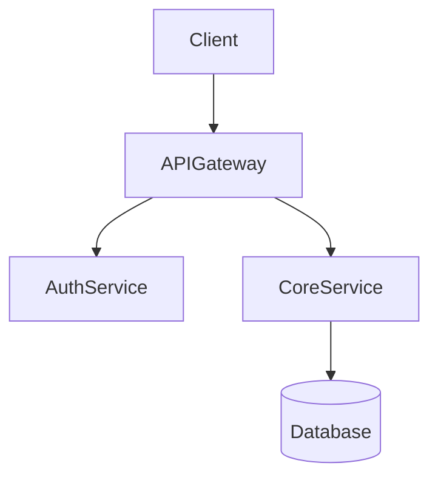

# Create Architecture

Design the architecture for: "$ARGUMENTS"

## Process

1. **Read existing architecture first**
   - Look for ADRs in `docs/decisions/`, `docs/adr/`, `docs/architecture/`
   - Read `CLAUDE.md` for project constraints
   - Use `vexor-cli` to locate relevant existing components and integration points

2. **Identify affected components**
   - Which existing modules, services, or layers does this change touch?
   - What interfaces will change? Are there breaking changes?

3. **Evaluate alternatives** — for each key decision:
   - Consider at least 2 options
   - Assess: performance, maintainability, complexity, reversibility
   - Explicitly reject alternatives with reasons

4. **Produce ADRs** — one ADR per significant decision:

```
# ADR-NNN: <title>

**Status:** Proposed
**Date:** YYYY-MM-DD

## Context
<What problem are we solving? What constraints exist?>

## Decision
<What is being decided?>

## Rationale
<Why this option?>

## Alternatives Considered
- Option A: <description> — rejected because <reason>

## Consequences
Positive: <benefits>
Negative: <trade-offs>
Risks: <risks>
```

5. **Produce component diagram** (Mermaid or ASCII):



6. **Define interfaces** — explicit method signatures and data shapes:

```typescript
// Service interface
interface UserService {
  create(data: CreateUserDto): Promise<User>
  findById(id: string): Promise<User | null>
}

// Data shapes
type CreateUserDto = { email: string; role: 'admin' | 'user' }
type User = { id: string; email: string; role: string; createdAt: Date }
```

7. **Flag breaking changes** — list any consumer updates required

## Output

- ADRs (one per decision) saved to `docs/decisions/` or `docs/adr/`
- Component diagram (Mermaid)
- Interface definitions (typed signatures)
- Migration notes (breaking changes, rollout order)
